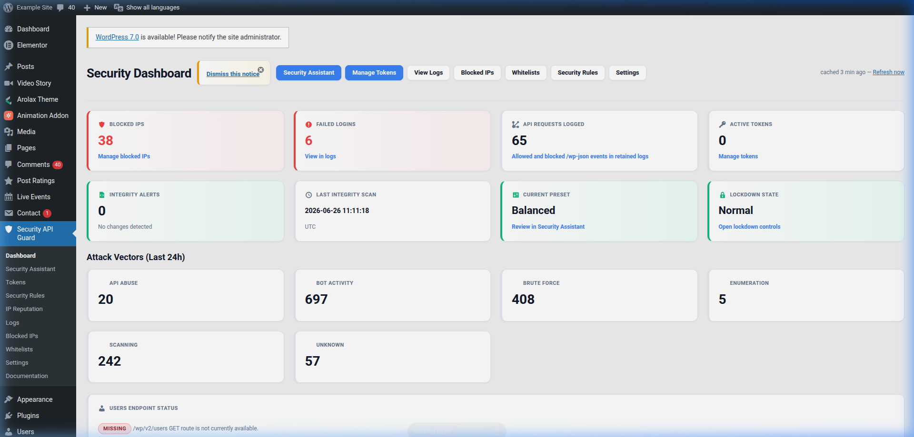
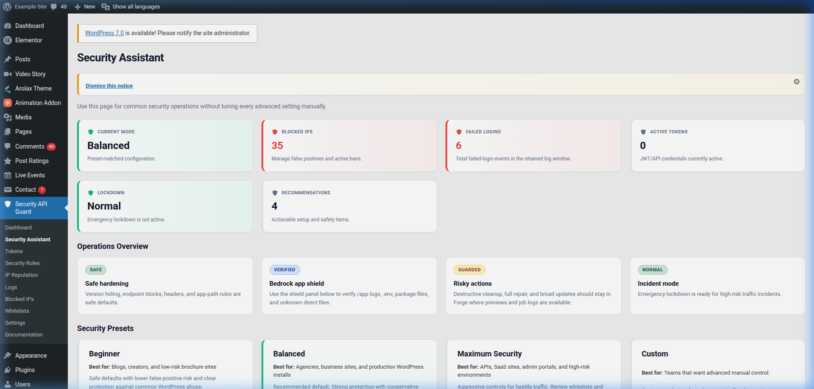
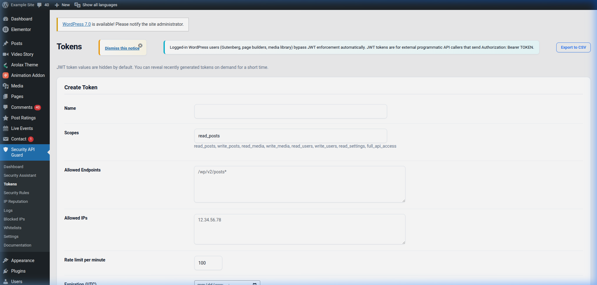
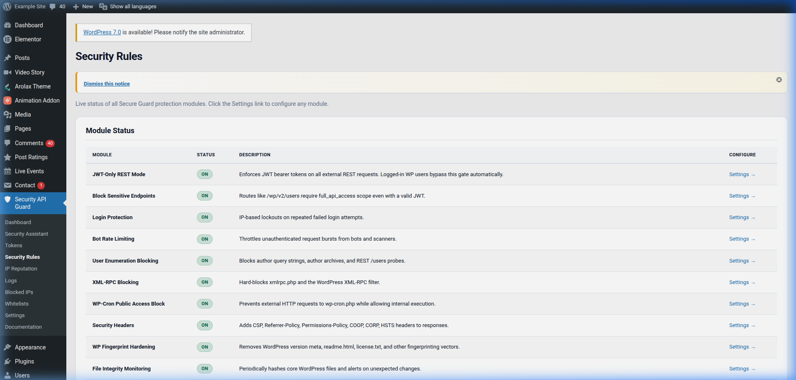
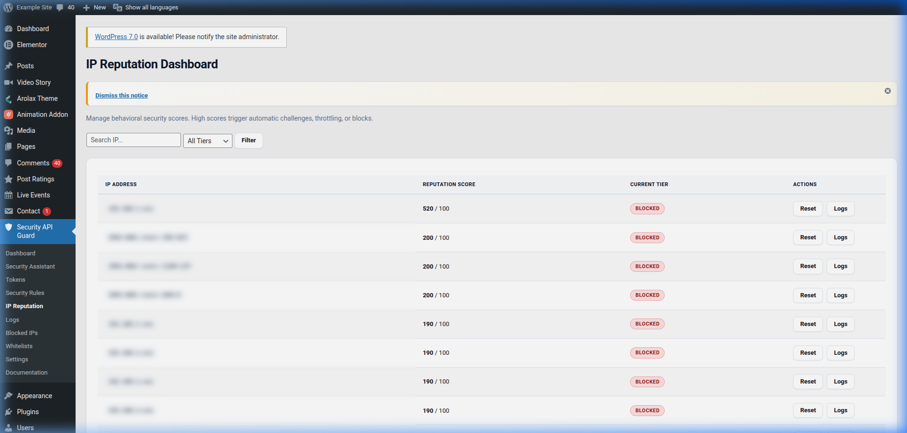
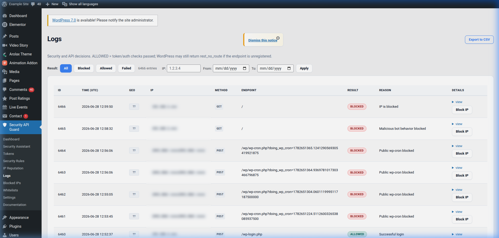
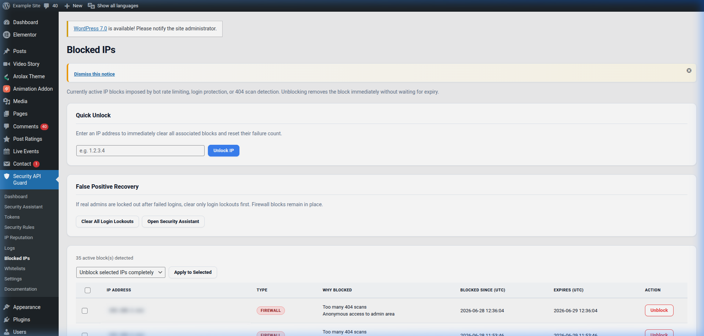
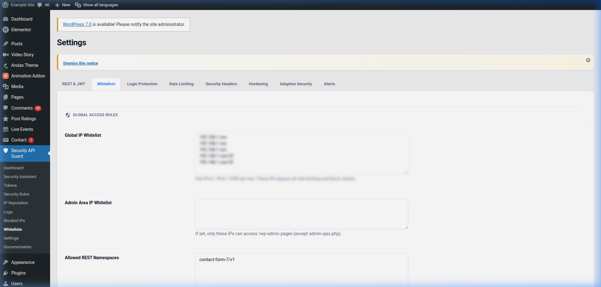
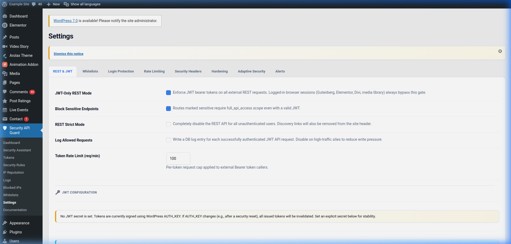
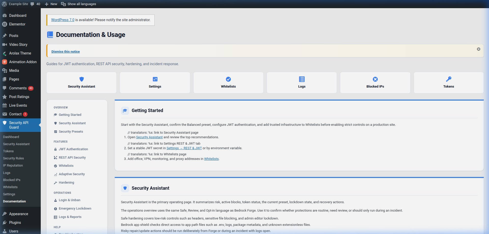

# Secure Guard Admin Interface Guide

This guide provides an overview of the administration interface for the **Secure Guard** plugin. All screenshots have been sanitized to hide sensitive network details (IP addresses, specific email domains, API tokens, and credentials) for privacy.

---

## Table of Contents
1. [Dashboard](#1-dashboard)
2. [Security Assistant](#2-security-assistant)
3. [Tokens (API Authentication)](#3-tokens-api-authentication)
4. [Security Rules (Firewall & Rate Limiting)](#4-security-rules-firewall--rate-limiting)
5. [IP Reputation](#5-ip-reputation)
6. [Audit Logs](#6-audit-logs)
7. [Blocked IPs](#7-blocked-ips)
8. [Whitelists](#8-whitelists)
9. [Settings](#9-settings)
10. [Documentation](#10-documentation)

---

## 1. Dashboard
The **Dashboard** serves as the central control room for Secure Guard. It displays critical health checks, recent blocked activities, reputation statistics, and general threat indicators.

*   **Key Information:** Real-time visual metrics, overall environment status (e.g. Bedrock vs. Standard), and quick status toggles.

---

## 2. Security Assistant
The **Security Assistant** orchestrates high-frequency security presets and environment health diagnostics. It scans for configuration exposures (like `.env`, `debug.log`, or package files) and provides direct remediation guidelines.

*   **Key Information:** Preset selectors (Beginner, Balanced, Maximum Security), rollback snapshots, and automated environment audits.

---

## 3. Tokens (API Authentication)
The **Tokens** screen manages cryptographically secure JSON Web Tokens (JWT) for decoupling and headless API integrations. 

*   **Key Information:** Granular permission scopes (e.g., `read_posts`, `write_posts`), allowed endpoint pattern matching, IP restrictions, and token lifecycle management.

---

## 4. Security Rules (Firewall & Rate Limiting)
The **Security Rules** interface defines access policies for rate limiting, bot protection, and standard endpoint blocks (e.g., XML-RPC, User Enumeration).

*   **Key Information:** Bot scoring thresholds, general request rate-limiting configurations, and hard-blocking for sensitive paths.

---

## 5. IP Reputation
The **IP Reputation** page shows a local score registry tracking visitor behaviors. Requests triggering rules increase their IP reputation threat score. High-score IPs are automatically throttled or blocked.

*   **Key Information:** Registered IPs, threat scores, event logs, and status classification (Throttled, Challenged, Blocked).

---

## 6. Audit Logs
The **Audit Logs** track all security-relevant WordPress actions, including blocked route probes, authentication decisions, failed login attempts, and key settings updates.

*   **Key Information:** Client IP, path, method (GET/POST), event result (ALLOWED/BLOCKED), and detailed contextual metadata.

---

## 7. Blocked IPs
The **Blocked IPs** dashboard provides false-positive recovery mechanisms. Administrators can clear block transients and logs for specific IPs here without disrupting general firewall policies.

*   **Key Information:** List of locked/blocked IPs, lockout category (login-block vs. ip-block), and recovery action buttons (Full Unblock or Login-Only Unblock).

---

## 8. Whitelists
The **Whitelists** panel allows adding trusted network paths or services to bypass the adaptive firewall.

*   **Key Information:** Global CIDR IP lists, permitted custom user-agent lists, and quick-allow presets for monitoring tools (e.g. Pingdom, UptimeRobot).

---

## 9. Settings
The **Settings** interface configures the plugin's underlying parameters, including JWT signing secrets, custom issuers, HSTS/CSP headers, and DB auto-cleanup thresholds.

*   **Key Information:** Cryptographic keys, HSTS headers, Content Security Policy structures, and cron maintenance intervals.

---

## 10. Documentation
The **Documentation** page provides built-in reference documentation covering typical use cases, hooks, and developer filters.

*   **Key Information:** Quick anchors for preset modifications, recovery SQL steps, Bedrock setups, and REST API troubleshooting.
